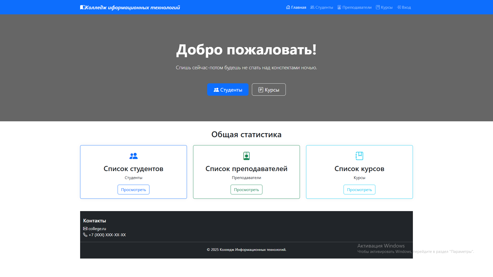
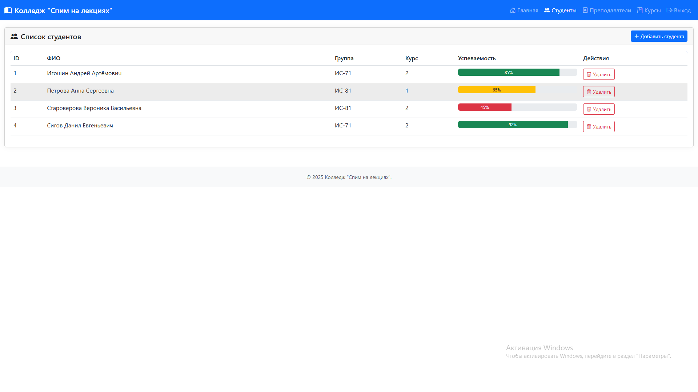
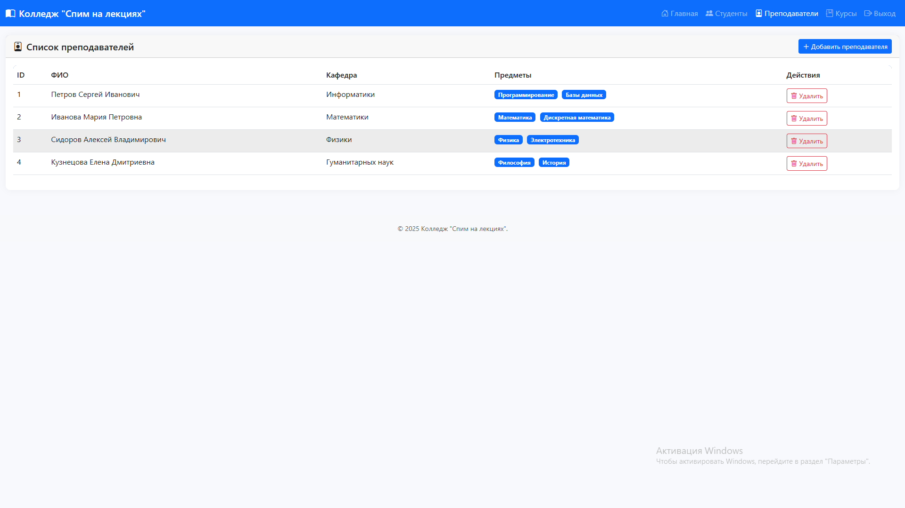
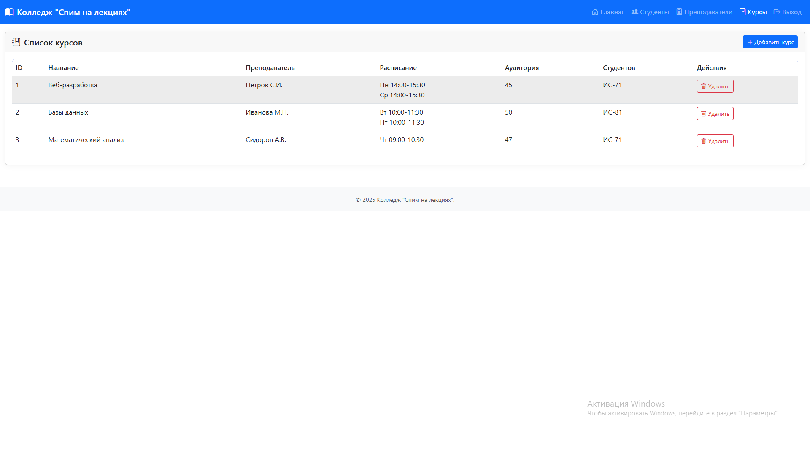
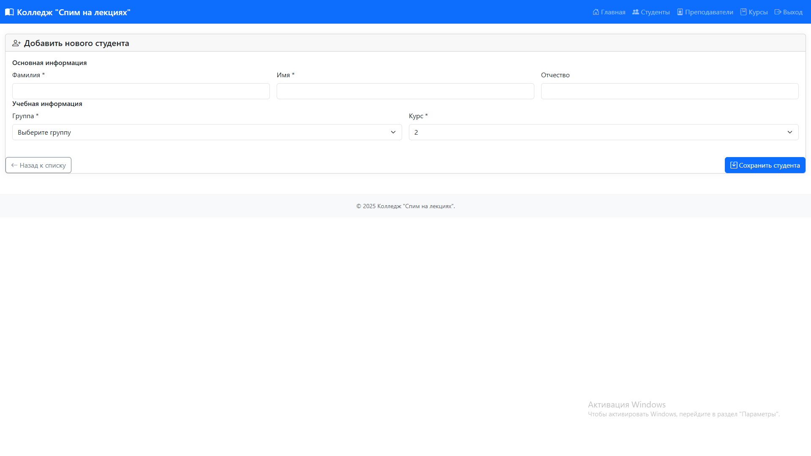

# Учебное заведение  

 Система управления студентами, преподавателями и курсами в вузе/колледже.

## Скриншоты  
### Раздел 1: Главный экран  
  

### Раздел 2: Список студентов  
  

### Раздел 3: Преподаватели 
  

### Раздел 4: Курсы
 

### Раздел 5: Авторизация 
 

### Раздел 6: Добавление студентов
  
